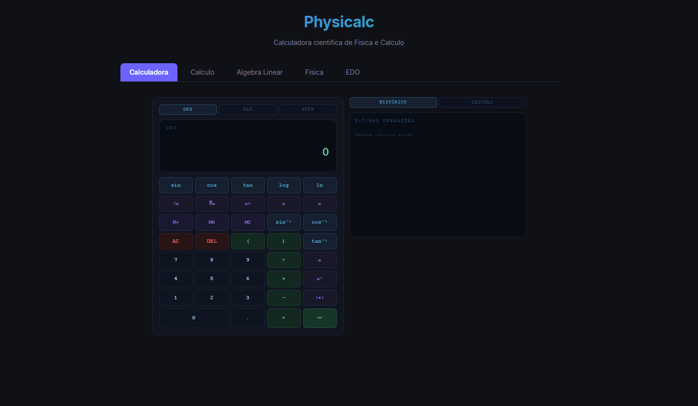

# Physicalc 🧮

> API REST de cálculo científico construída em **Go** com frontend **React**. Implementa algoritmos numéricos do zero — sem bibliotecas matemáticas externas.


---

## 📸 Preview

> 

---

## 🎯 Sobre o projeto

O **Physicalc** nasceu como projeto de portfólio para demonstrar uso de Go em aplicações com lógica matemática e científica.

Todo o backend foi construído em Go puro — os algoritmos (Simpson, Runge-Kutta, Gauss-Jordan, etc.) foram implementados manualmente, sem dependências matemáticas externas, o que demonstra compreensão real dos métodos numéricos.

---

## ✨ Funcionalidades

### ∫ Cálculo
- Integração numérica pelos métodos de **Simpson 1/3** e **Trapézio Composto**
- Derivada numérica por **diferenças centrais** e segunda derivada
- Derivadas parciais ∂f/∂x e ∂f/∂y
- Limite numérico bilateral com verificação de convergência

### ⊕ Álgebra Linear
- **Vetores**: adição, subtração, produto escalar (dot), produto vetorial (cross), norma, normalização, ângulo
- **Matrizes**: multiplicação, determinante (Laplace recursivo), inversa (Gauss-Jordan com pivotamento parcial), transposta, traço

### ⚡ Física
- **Cinemática**: MRUA completo, distância real com reversão de direção, lançamento oblíquo
- **Dinâmica**: 2ª Lei de Newton, trabalho, energia cinética e potencial, quantidade de movimento
- **MCU**: período, frequência, velocidade angular e linear, força centrípeta
- **MHS**: oscilador harmônico — frequência, período, velocidades e acelerações máximas

### ∂ Equações Diferenciais
- Método de **Euler** (1ª ordem)
- **Runge-Kutta 4** (erro local O(h⁵))
- 6 EDOs predefinidas: decaimento, crescimento, logística, oscilação, resfriamento de Newton, queda com arrasto
- Gráfico interativo da solução y(t)

---

## 🏗️ Arquitetura

```
physicalc/
├── cmd/server/          # Ponto de entrada da aplicação
├── internal/
│   ├── calculus/        # Integração, derivadas, limites
│   ├── algebra/         # Vetores e matrizes
│   ├── physics/         # Cinemática, dinâmica, MCU, MHS
│   └── ode/             # Euler e Runge-Kutta 4
├── pkg/
│   ├── parser/          # Parsing de expressões e matrizes
│   └── formatter/       # Saída em LaTeX e JSON
├── api/                 # Handlers e rotas HTTP (chi router)
└── frontend/            # React + Vite + Recharts
```

**Decisões técnicas:**
- `chi` para roteamento — leve e idiomático em Go
- Algoritmos implementados do zero para fins didáticos e de portfólio
- Frontend desacoplado via proxy Vite em dev e Nginx em produção
- Build Docker multi-stage — imagem final com ~15MB

---

## 🚀 Como rodar

### Com Docker (recomendado)

```bash
git clone https://github.com/SEU_USUARIO/physicalc.git
cd physicalc
docker-compose up --build
```

| Serviço | URL |
|---|---|
| Frontend | http://localhost:3000 |
| API | http://localhost:8080 |
| Swagger | http://localhost:8080/swagger/index.html |

### Localmente

**Pré-requisitos:** Go 1.22+, Node.js 20+

```bash
# Backend
go mod tidy
make run

# Frontend (outro terminal)
cd frontend
npm install
npm run dev
```

---

## 🧪 Testes

```bash
make test                    # todos os testes com cobertura
make test-pkg PKG=calculus   # apenas cálculo
make test-pkg PKG=algebra    # apenas álgebra
```

Exemplos de casos testados:
- `∫x² de 0 a 1 = 0.3333...` (Simpson, tolerância 1e-6)
- `∫sin(x) de 0 a π = 2.0` (tolerância 1e-8)
- `[1,0,0] × [0,1,0] = [0,0,1]` (produto vetorial)
- `A * A⁻¹ ≈ I` (verificação da inversa)
- RK4 mais preciso que Euler para mesma EDO e mesmo passo h

---

## 📡 Endpoints da API

| Método | Rota | Descrição |
|---|---|---|
| `POST` | `/api/calculus/integrate` | Integração numérica |
| `POST` | `/api/calculus/derivative` | Derivada em um ponto |
| `POST` | `/api/calculus/limit` | Limite numérico |
| `POST` | `/api/algebra/vector` | Operações com vetores |
| `POST` | `/api/algebra/matrix` | Operações com matrizes |
| `POST` | `/api/physics/kinematics` | Cinemática — MRUA |
| `POST` | `/api/physics/dynamics` | Dinâmica — Newton |
| `POST` | `/api/ode/solve` | Resolver EDO numericamente |
| `GET`  | `/api/health` | Health check |

### Exemplos curl

**Integrar x² de 0 a 1:**
```bash
curl -X POST http://localhost:8080/api/calculus/integrate \
  -H "Content-Type: application/json" \
  -d '{"function":"x2","a":0,"b":1,"n":1000}'
```
```json
{ "simpson": 0.3333333333, "trapezoid": 0.3333335000 }
```

**Produto vetorial:**
```bash
curl -X POST http://localhost:8080/api/algebra/vector \
  -H "Content-Type: application/json" \
  -d '{"operation":"cross","a":[1,0,0],"b":[0,1,0]}'
```
```json
{ "result": { "Components": [0, 0, 1] } }
```

**Resolver EDO de decaimento com RK4:**
```bash
curl -X POST http://localhost:8080/api/ode/solve \
  -H "Content-Type: application/json" \
  -d '{"func":"decay","method":"rk4","y0":1,"t0":0,"t_end":5,"h":0.1}'
```

---

## 📐 Algoritmos implementados

| Algoritmo | Módulo | Precisão |
|---|---|---|
| Regra de Simpson 1/3 | calculus | Erro O(h⁴) |
| Trapézio Composto | calculus | Erro O(h²) |
| Diferenças Centrais | calculus | Erro O(h²) |
| Expansão de Laplace | algebra | O(n!) — matrizes pequenas |
| Gauss-Jordan | algebra | O(n³) com pivotamento parcial |
| Euler | ode | Erro local O(h²) |
| Runge-Kutta 4 | ode | Erro local O(h⁵) |

---

## 🛠️ Tecnologias

| Camada | Tecnologia |
|---|---|
| Backend | Go 1.22 |
| Router | chi v5 |
| Frontend | React 18 + Vite 5 |
| Gráficos | Recharts |
| Infra | Docker + Docker Compose + Nginx |
| Testes | `testing` + testify |

---

## 📄 Licença

MIT — veja [LICENSE](LICENSE) para detalhes.

---

<div align="center">
  Feito com Go 🐹 por <a href="https://github.com/SEU_USUARIO">@SEU_USUARIO</a>
</div>